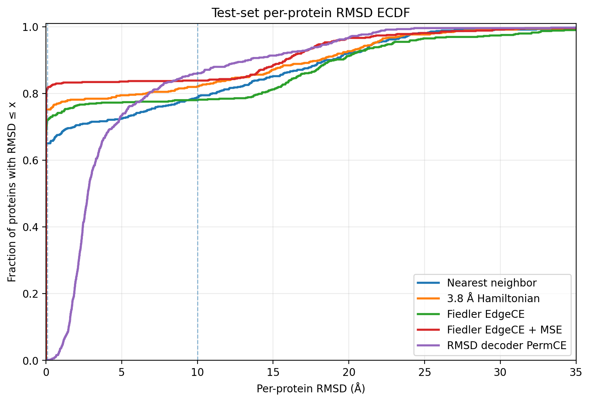
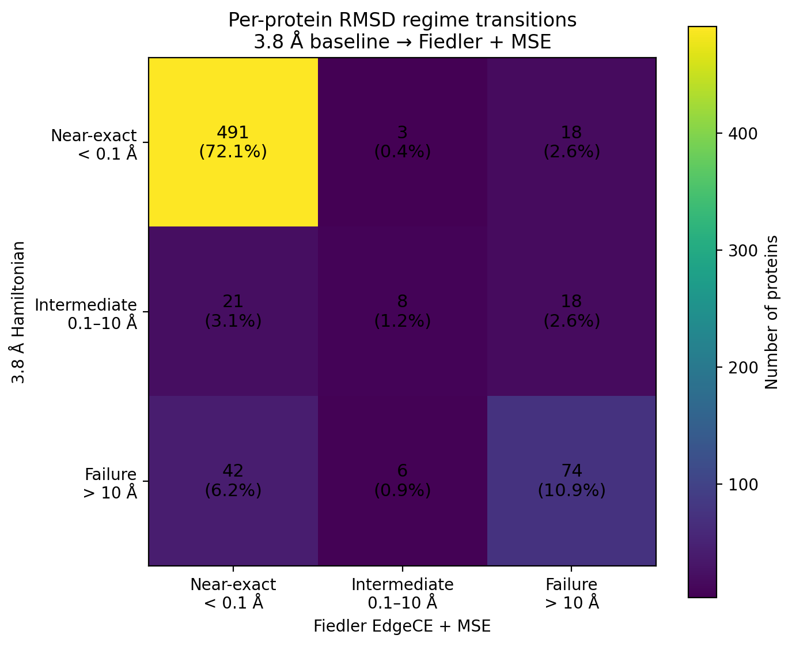
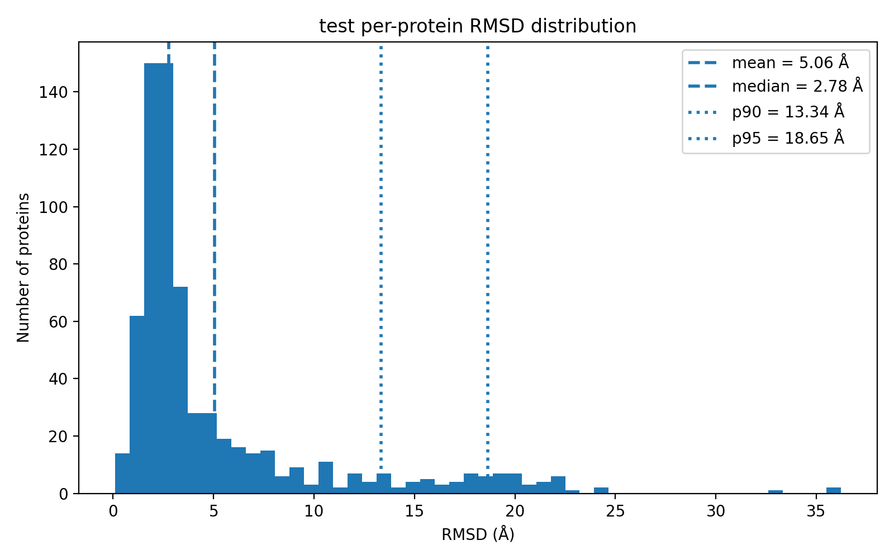
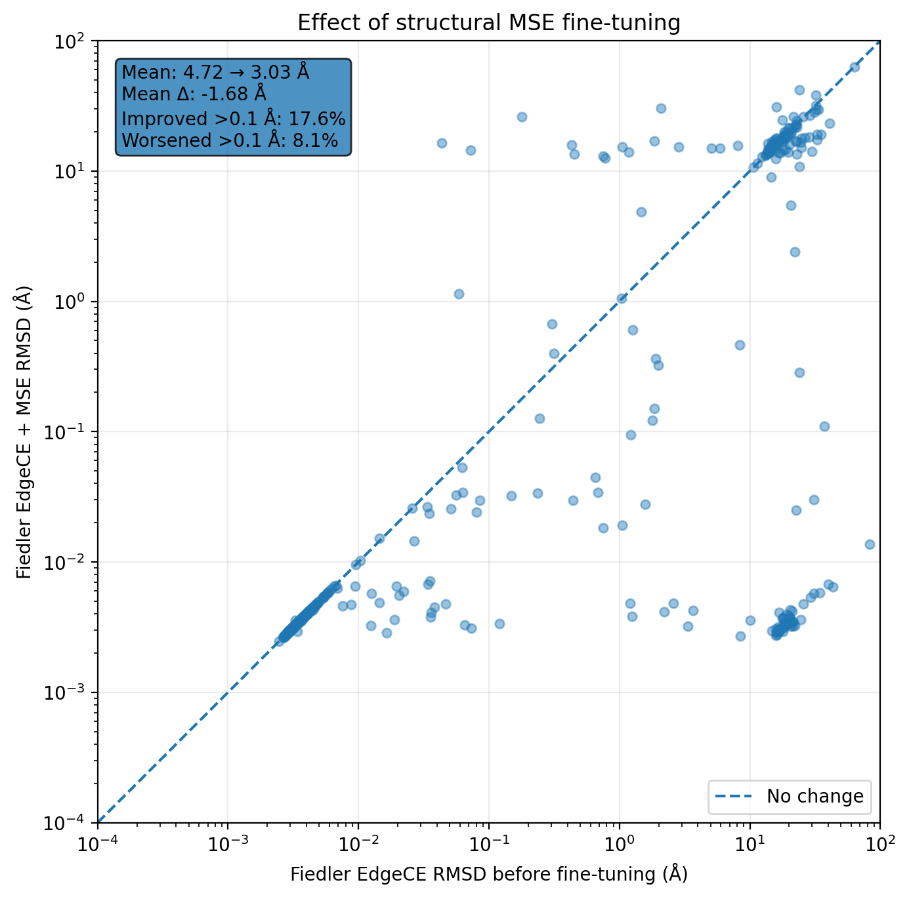

# Differentiable Protein Backbone Ordering from Unordered Point Clouds

## Overview

This project studies the recovery of protein backbone sequence order from an unordered set of Cα coordinates. Given a protein structure represented only as a point cloud, the goal is to recover an ordering of the points corresponding to the backbone sequence.

This is a global combinatorial problem: an input containing \(N\) residues admits \(N!\) possible permutations. At the same time, protein backbone geometry provides strong local information, most notably the approximately 3.8 Å spacing between consecutive Cα atoms.

I compare two deterministic geometric baselines with two differentiable learned approaches:

- **Nearest-neighbor ordering**
- **3.8 Å Hamiltonian ordering**
- **Learned Fiedler ordering**, based on a predicted soft adjacency matrix followed by differentiable spectral ordering
- **Direct permutation decoding**, which predicts the assignment between target sequence positions and unordered input points

The main result is that a simple 3.8 Å geometric heuristic is already a strong baseline. A Fiedler model trained only with local edge supervision does not outperform it. However, because the Fiedler ordering pipeline is differentiable, it can be fine-tuned using a downstream structural reconstruction objective. This reduces mean test RMSD from **4.72 Å to 3.03 Å**, increases the fraction of near-exact reconstructions from **72.0% to 81.4%**, and reduces the fraction of catastrophic \(>10\) Å failures from **22.0% to 16.2%**. The fine-tuned model also outperforms the 3.8 Å Hamiltonian baseline in mean structural RMSD.

The results suggest that the main benefit of differentiable ordering is not necessarily superior local connectivity prediction, but the ability to optimize the global ordering directly for downstream structural reconstruction.

---

## Problem

Let an ordered protein backbone be represented by its Cα coordinates

$$
X = (x_1, x_2, \ldots, x_N), \qquad x_i \in \mathbb{R}^3.
$$

The model instead receives an unordered permutation of these coordinates,

$$
X_{\pi} = (x_{\pi(1)}, x_{\pi(2)}, \ldots, x_{\pi(N)}),
$$

and must recover the original sequential ordering, up to reversal of the protein chain.

The task can therefore be viewed as predicting a permutation of the input point cloud. The recovered ordering is evaluated both directly, using permutation-based metrics, and geometrically, using RMSD after rigid alignment.

A particular challenge is that local correctness does not necessarily imply a globally correct sequence. A small number of wrong connections can produce a large change in the final ordering and therefore a catastrophic reconstruction error.

---

## Methods

### Deterministic geometric baselines

Two simple geometric ordering methods provide reference points for the learned models.

#### Nearest neighbor

Starting from several possible residues, the method greedily selects the closest unused Cα coordinate as the next residue and retains the lowest-cost resulting path.

This baseline assumes only that consecutive backbone atoms tend to be spatially close.

#### 3.8 Å Hamiltonian heuristic

A stronger geometric prior uses the characteristic distance between consecutive Cα atoms in a protein backbone.

Instead of minimizing the raw distance between consecutive points, the path cost favors edges close to 3.8 Å:

$$
c(i,j) = \left(\|x_i-x_j\| - 3.8\right)^2.
$$

A multi-start greedy search is used to obtain a low-cost Hamiltonian path.

Although simple and non-learned, this turns out to be a strong baseline.

---

### Differentiable Fiedler ordering

The unordered point cloud is embedded using an SE(3)-equivariant graph-attention encoder based on Equiformer [Liao and Smidt, 2023](#equiformer2023). A learned edge head predicts pairwise backbone connectivity scores, which are converted into a soft weighted adjacency matrix.

The resulting spectral scores are converted into a soft permutation matrix using a Sinkhorn relaxation introduced in [Mena et al., 2018](#mena2018). This provides a differentiable approximation to discrete sorting, allowing gradients from downstream reconstruction losses to propagate through the ordering operation and back into the learned graph.

The pipeline is therefore:

```text
unordered Cα coordinates
        ↓
equivariant graph encoder
        ↓
learned soft edge scores
        ↓
soft adjacency matrix
        ↓
graph Laplacian
        ↓
Fiedler vector
        ↓
soft permutation
        ↓
ordered coordinates
```

Two training stages are evaluated.

#### EdgeCE

The initial model is trained using local edge classification. Candidate edges are classified according to whether they connect consecutive residues in the ground-truth backbone.

This provides direct supervision for the learned graph but does not explicitly optimize the final reconstructed coordinates.

#### EdgeCE + MSE fine-tuning

The EdgeCE checkpoint is subsequently fine-tuned using both the local edge objective and a structural reconstruction loss.

Because the spectral ordering pipeline is differentiable, Kabsch-aligned coordinate MSE can be backpropagated through the soft ordering operation and into the learned graph.

This provides a direct test of whether downstream structural supervision can improve an ordering initially learned from local connectivity labels.

---

### Direct permutation decoder

A second learned model predicts the ordering more directly.

Instead of deriving the permutation spectrally from a predicted adjacency matrix, the decoder predicts assignment logits between target sequence positions and unordered input points. These assignments are converted into a soft permutation matrix and used to reconstruct the ordered coordinates.

The model is trained primarily with permutation cross-entropy (**PermCE**).

Structural MSE fine-tuning was also investigated. In the experiments performed here, this fine-tuning overfit the training objective and did not improve held-out reconstruction performance. The reported direct-decoder result therefore uses the PermCE-trained model.

This negative result provides a useful contrast to the Fiedler model: having a differentiable ordering mechanism is not, by itself, sufficient to guarantee that downstream structural fine-tuning will be successful.

---

## Experimental setup

### Data

The protein structures used in this project are derived from the
CATH-based dataset released with:

John Ingraham et al., "Generative Models for Graph-Based Protein Design,"
NeurIPS 2019.

The original train, validation, and test assignments were preserved.
The data were modified for this project by extracting Cα coordinates,
filtering malformed/incomplete chains, and serializing the resulting records
as PyTorch tensors.

CATH is made available under the Creative Commons Attribution 4.0
International (CC BY 4.0) license.

CATH:
https://www.cathdb.info/

Original dataset release:
https://people.csail.mit.edu/ingraham/graph-protein-design/data/cath/

### Direction ambiguity

A protein backbone can be recovered in either forward or reverse sequence direction from geometry alone. Metrics therefore treat a predicted sequence and its reversal as equivalent where appropriate. A more refined formulation could require recovery of a specific chain direction rather than treating forward and reverse orderings as equivalent.

### Model selection

Learned-model checkpoints are selected using the **lowest validation mean RMSD**.

The final reported metrics are evaluated on the held-out test set using the selected checkpoint.

### Metrics

Because reconstruction errors are strongly non-Gaussian, mean RMSD alone does not adequately characterize performance.

The main reported metrics are:

- mean RMSD
- median RMSD
- 90th percentile RMSD
- 95th percentile RMSD
- fraction of proteins with RMSD below 0.1 Å
- fraction of proteins with RMSD above 10 Å
- residue-wise permutation accuracy

For the Fiedler model, additional diagnostics include exact-order fraction, EdgeCE, positive-edge recall, candidate-edge recall, and spectral statistics.

---

## Results

### Overall performance

| Method | Mean RMSD ↓ | Median RMSD ↓ | P90 RMSD ↓ | <0.1 Å ↑ | >10 Å ↓ | Perm. acc. ↑ |
|---|---:|---:|---:|---:|---:|---:|
| Nearest neighbor | 4.537 Å | **0.0001 Å** | 18.468 Å | 65.1% | 21.1% | 0.804 |
| 3.8 Å Hamiltonian | 3.696 Å | **0.0001 Å** | 18.056 Å | 75.2% | 17.9% | **0.838** |
| Fiedler — EdgeCE | 4.716 Å | 0.0037 Å | 19.01 Å | 72.0% | 22.0% | 0.755 |
| **Fiedler — EdgeCE + MSE** | **3.035 Å** | 0.0036 Å | 15.789 Å | **81.4%** | 16.2% | 0.809 |
| RMSD decoder — PermCE | 5.06 Å | 2.78 Å | **13.34 Å** | 0.0% | **14.0%** | 0.502 |

The first notable observation is that the median RMSD is extremely small for all methods aside from the decoder. More than half of the proteins can therefore be reconstructed almost exactly even using the deterministic baselines.

Performance differences arise primarily from the **frequency and severity of failures**, rather than from small improvements on already-correct examples.

---

## Strong geometric priors provide competitive baselines

The nearest-neighbor baseline achieves a mean test RMSD of **4.54 Å**.

Explicitly introducing the expected Cα spacing substantially improves performance. The 3.8 Å Hamiltonian heuristic reaches **3.70 Å mean RMSD**, increases the near-exact reconstruction fraction from 65.1% to 75.2%, and obtains the highest residue-wise permutation accuracy of the evaluated methods at 83.8%.

This demonstrates that protein backbone geometry provides a very strong inductive bias for sequence recovery.

The deterministic baselines are therefore not merely weak reference methods: they represent competitive solutions against which a learned ordering mechanism must provide an additional advantage.

---

## Local edge supervision does not guarantee good global ordering

The Fiedler model trained using EdgeCE obtains a mean RMSD of **4.72 Å**.

Despite this relatively high mean error, its median RMSD is only **0.0037 Å**, and approximately **72%** of test proteins have RMSD below 0.1 Å.

This indicates that EdgeCE-trained Fiedler ordering is often essentially exact. Its poor mean performance is instead caused by a substantial tail of catastrophic failures:

- **22.0%** of proteins have RMSD above 10 Å.
- P90 RMSD is approximately **19.0 Å**.

The ordering problem is therefore strongly bimodal: many proteins are reconstructed almost perfectly, while a minority exhibit very large global ordering errors.

This also illustrates a limitation of purely local edge supervision. Very accurate prediction of individual backbone edges does not necessarily produce the weighted graph that gives the best global spectral ordering.

---

## Structural fine-tuning substantially improves Fiedler ordering

Fine-tuning the EdgeCE model with structural MSE produces the strongest learned result.

Mean test RMSD decreases from

$$
4.72\ \text{Å} \rightarrow 3.03\ \text{Å},
$$

a reduction of approximately **36%**.

The improvement is also visible throughout the error distribution:

| Metric | EdgeCE | EdgeCE + MSE |
|---|---:|---:|
| Mean RMSD | 4.716 Å | **3.035 Å** |
| Median RMSD | 0.0037 Å | **0.0036 Å** |
| P90 RMSD | 19.01 Å | **15.79 Å** |
| Near-exact, <0.1 Å | 72.0% | **81.4%** |
| Catastrophic, >10 Å | 22.0% | **16.2%** |
| Permutation accuracy | 75.5% | **80.9%** |
| Exact-order fraction | 72.7% | **82.0%** |

The median changes very little because already-successful proteins were already reconstructed almost perfectly. Instead, structural fine-tuning mainly improves the **failure tail**, converting additional proteins from globally incorrect orderings into near-exact reconstructions.



*Empirical cumulative distribution of per-protein RMSD on the held-out test set. Higher curves indicate a larger fraction of proteins reconstructed below a given RMSD threshold. The linear x-axis is truncated at 35 Å for readability.*

The ECDF makes the bimodal nature of the problem and the reduction of the catastrophic tail visible across the complete test set.

---

## Fine-tuned Fiedler ordering versus the geometric baseline

The fine-tuned Fiedler model achieves **3.03 Å mean RMSD**, compared with **3.70 Å** for the 3.8 Å Hamiltonian heuristic.

It also has:

- a higher fraction of near-exact predictions: **81.4% vs. 75.2%**
- a lower catastrophic-failure rate: **16.2% vs. 17.9%**
- a substantially lower P90 RMSD: **15.79 Å vs. 18.06 Å**

However, the deterministic heuristic retains higher residue-wise permutation accuracy:

$$
83.8\% \quad \text{vs.} \quad 80.9\%.
$$

The learned model should therefore not be interpreted as universally superior. Instead, it obtains better structural reconstruction according to RMSD while the geometric heuristic remains stronger on the residue-wise permutation metric.



*Per-protein RMSD regime transitions from the 3.8 Å Hamiltonian baseline to the Fiedler model after MSE fine-tuning. Most proteins are reconstructed nearly exactly by both methods. However, Fiedler + MSE rescues 48 of the 122 (>10 Å) baseline failures, including 42 proteins that move directly from catastrophic error to <0.1 Å RMSD. Conversely, 36 proteins that were below 10 Å with the baseline become >10 Å failures under Fiedler. This asymmetric redistribution helps explain why Fiedler + MSE achieves a lower mean RMSD despite not uniformly improving every protein.*

---

### Why differentiable ordering?

This ordering model originated from a broader attempt to use an ECT/IPT-based geometric representation as a lightweight representation of protein structure, inspired by *Point Cloud Synthesis Using Inner Product Transforms* [Röell and Rieck, 2025](#roellrieck2025). The aim was to encode protein geometry using a compact, permutation-invariant representation and reconstruct the corresponding Cα point cloud with a neural decoder.

Initial reconstruction experiments produced point clouds with good Chamfer-distance and ECT-based reconstruction losses. However, these objectives compare unordered geometry and do not establish a residue-to-residue correspondence with the target protein. Consequently, a direct coordinate MSE objective could not effectively guide reconstruction when the predicted points were geometrically plausible but appeared in an arbitrary order.

A natural solution was to recover the backbone order after point-cloud reconstruction. Simple geometric procedures, such as the Hamiltonian-path heuristics evaluated in this work, can perform extremely well when the predicted coordinates closely follow ideal backbone geometry. However, the reconstructed point clouds produced by the upstream model are imperfect, especially at the beginning of training: points can be displaced enough that a fixed geometric heuristic no longer reliably recovers the correct chain. More importantly, the discrete path-construction procedure is not differentiable, preventing a downstream coordinate reconstruction loss from propagating through the ordering step and into the point-cloud decoder.

This motivated the development of a **differentiable protein-ordering head**. Rather than learning ordering only from imperfect reconstructed point clouds, the ordering model is first trained directly on ground-truth protein structures, where the correct backbone order is known. It can then be fine-tuned on the unordered point clouds produced by the upstream ECT-based reconstruction model. The goal is therefore to provide the reconstruction pipeline with an ordering module that has already learned what protein backbone geometry is expected to look like.

The Fiedler formulation is particularly useful in this setting because the complete path

**predicted point cloud → learned adjacency → graph Laplacian → Fiedler vector → soft permutation → ordered coordinates**

is differentiable. A structural reconstruction loss can therefore propagate through the ordering operation and ultimately back into the model producing the point cloud. 

One of the most interesting observations is that structural fine-tuning substantially improves global ordering despite worsening the local EdgeCE metric.

The EdgeCE value changes approximately from

$$
1.9\times10^{-4}
$$

before fine-tuning to

$$
1.4\times10^{-3}
$$

after fine-tuning.

At the same time:

- mean RMSD improves from 4.72 Å to 3.03 Å;
- permutation accuracy increases;
- exact-order frequency increases;
- the catastrophic failure tail decreases.

This provides evidence that the local edge-classification objective is not perfectly aligned with the global spectral ordering objective.

A soft adjacency matrix that is optimal for independent local edge classification need not be the adjacency matrix whose Laplacian produces the most useful Fiedler ordering.

Because the Fiedler pipeline is differentiable, downstream structural loss can reshape the predicted graph toward one that produces a better final reconstruction, even at the expense of the local classification metric.

---

## Direct permutation decoding

The direct permutation decoder provides a second approach to differentiable ordering. Rather than predicting a graph and extracting an ordering through its Fiedler vector, this model directly predicts a soft permutation matrix assigning unordered input points to sequence positions.



*Per-protein RMSD distribution for the PermCE-trained direct decoder on the held-out test set. Unlike the Fiedler and geometric approaches, the model produces essentially no near-exact reconstructions, but its errors are more concentrated in the moderate-RMSD regime.*

The PermCE-trained decoder reaches a mean RMSD of **5.06 Å**, a median RMSD of **2.78 Å**, and a P90 RMSD of **13.34 Å**. No test proteins are reconstructed below 0.1 Å RMSD, while **14.0%** exceed 10 Å. Its permutation accuracy is **0.502**.

Structural MSE fine-tuning was also tested for this architecture. Unlike the Fiedler model, adding downstream MSE supervision did not improve held-out performance and instead led to overfitting. This provides an important contrast between the two differentiable formulations. In the Fiedler model, structural supervision can reshape the learned graph so that its global spectral ordering improves substantially. In the direct decoder, the same general strategy does not yield a corresponding generalization improvement.

These results indicate that differentiability is necessary for end-to-end structural supervision, but is not by itself sufficient to make such supervision effective. Its usefulness also depends on the parameterization, inductive bias, and optimization properties of the ordering mechanism.

---

## Per-protein analysis

Aggregate means hide much of the behavior observed in this task.

All methods exhibit a large population of near-perfect reconstructions together with a smaller number of very large errors. Per-protein comparisons are therefore useful for understanding how the methods differ.

### Effect of MSE fine-tuning



*Paired per-protein test RMSD before and after structural MSE fine-tuning of the Fiedler model. Both axes are logarithmic, and each point represents the same protein under the same deterministic input permutation. Most proteins change little: 74.3% differ by at most 0.1 Å and the median paired RMSD change is approximately zero. The improvement in mean RMSD from 4.72 Å to 3.03 Å is instead driven by a smaller number of large corrections. Of the 150 proteins with RMSD >10 Å before fine-tuning, 55 are reduced below 10 Å and 50 are reconstructed to <0.1 Å. Conversely, 15 previously non-catastrophic examples become >10 Å failures after fine-tuning.*

This result suggests that structural MSE fine-tuning primarily acts by correcting a subset of catastrophic global ordering failures rather than by uniformly improving already-correct predictions. This is consistent with the near-zero median RMSD of both Fiedler models: most proteins are already ordered almost perfectly, while aggregate performance is dominated by a relatively small high-error tail.

### Failure overlap

Using RMSD \(>10\) Å as a simple definition of catastrophic failure allows the methods' failure sets to be compared directly.

| Outcome | Number of proteins |
|---|---:|
| EdgeCE fails, MSE fine-tuning fixes | **55** |
| Both Fiedler variants fail | **95** |
| 3.8 Å fails, Fiedler+MSE succeeds | **48** |
| Fiedler+MSE fails, 3.8 Å succeeds | **36** |

These results show that the learned and geometric approaches do not fail on exactly the same proteins. Fine-tuning rescues a substantial subset of EdgeCE failures, while the remaining mismatch with the 3.8 Å baseline suggests that the two methods capture partly complementary structural cues.

---

## Discussion

### Protein ordering is dominated by catastrophic rather than incremental errors

The extremely low median RMSD values show that these methods frequently recover an essentially exact ordering.

The main performance differences arise from a minority of proteins on which the inferred global path is incorrect.

This suggests that future work should focus less on improving already-correct reconstructions and more on detecting or preventing catastrophic ordering failures.

### Protein geometry is a powerful prior

The 3.8 Å Hamiltonian heuristic performs extremely well despite containing no learned parameters.

This reflects the strong structural constraints imposed by the protein backbone. Any learned method should therefore be compared with physically motivated geometric heuristics rather than only generic baselines.

### Local connectivity and global ordering are different objectives

The Fiedler experiments show that optimizing local connectivity alone does not necessarily optimize the final global ordering.

Spectral methods are inherently global: small changes in the weighted adjacency matrix can alter the Laplacian eigenvectors and therefore the recovered sequence.

The improvement after structural fine-tuning, despite worse EdgeCE, provides direct evidence of this objective mismatch.

### The main advantage of learned Fiedler ordering is differentiability

EdgeCE-only Fiedler ordering is not better than the strongest deterministic baseline.

The important advantage appears only once its differentiability is exploited.

Structural gradients flowing through

```text
ordered coordinates
       ↑
soft permutation
       ↑
Fiedler vector
       ↑
soft adjacency
       ↑
neural edge predictions
```

allow the model to optimize its local representation for the final reconstruction objective.

In this sense, the learned spectral model is valuable not simply because it replaces a heuristic, but because it creates a trainable interface between unordered geometry and downstream structural objectives.

---

## Limitations

Several limitations should be considered when interpreting these results.

- Computational constraints limited the number of full training runs and prevented extensive multi-seed evaluation.
- Hyperparameters were not exhaustively optimized.
- All methods retain a significant catastrophic-error tail.
- The Fiedler results indicate sensitivity of global spectral ordering to the learned adjacency matrix.
- Structural fine-tuning of the direct permutation decoder overfit rather than improving held-out performance.
- Results are specific to the dataset and preprocessing used in this repository and may not directly generalize to arbitrary protein structures or experimentally noisy coordinates.
- The deterministic baselines exploit a strong known physical prior, whereas the learned methods optimize more flexible representations; the comparison therefore reflects both model design and prior knowledge.

---

## Reproducing the experiments

The repository uses `uv` for environment management.

```bash
uv sync
```

### Hamiltonian baselines

Run both nearest-neighbor and 3.8 Å Hamiltonian baselines on the test set:

```bash
uv run python src/train_rmsd_decoder.py \
    --config configs/rmsd.yaml \
    --benchmark_only
```

This produces aggregate metrics as well as per-protein benchmark outputs.

### Fiedler EdgeCE

```bash
uv run python src/train_fiedler.py \
    --config configs/fiedler.yaml \
    --edge-warmup-steps 0 \
    --global-ramp-steps 0 \
    --tau-start 0.05 \
    --tau-end 0.05 \
    --val_tau 0.05 \
    --w-edge 1.0 \
    --w-perm 0.0 \
    --w-mse 0.0 \
    --w-dr 0.0 \
    --w-dist 0.0 \
    --check-spectral-grad-every 0 \
```

### Fiedler EdgeCE + MSE fine-tuning

```bash
uv run python src/train_fiedler.py \
    --config configs/fiedler.yaml \
    --finetune_from results/fiedler_train_ece_fiedler_e2e/fiedler_best.ckpt \
    --lr 1e-5 \
    --seed 1111 \
    --edge-warmup-steps 0 \
    --global-ramp-steps 0 \
    --tau-start 0.05 \
    --tau-end 0.05 \
    --val_tau 0.05 \
    --w-edge 1.0 \
    --w-perm 0.0 \
    --w-mse 1.0 \
    --w-dr 0.0 \
    --w-dist 0.0 \
    --check-spectral-grad-every 100 \
```

### RMSD permutation decoder

```bash
uv run python src/train_rmsd_decoder.py --config configs/rmsd.yaml \
    --w-edge 0 \
    --w-perm 1 \
    --w-mse 0 \
    --w-dr 0 \
    --w-dist 0 \
```

---

## Repository structure

```text
protein_ordering/
├── configs/              # experiment configurations
├── licenses/             # preserved third-party software licenses
├── results/              # final metrics, per-protein outputs, and figures
├── src/
│   ├── benchmarks/       # deterministic geometric baselines
│   ├── datasets/         # protein point-cloud datasets
│   ├── metrics/          # ordering and structural losses
│   ├── models/           # Fiedler and direct permutation models
│   ├── training/         # corruption and training utilities
│   ├── result_analysis/  # scripts used for final per-protein analyses
│   ├── tests/            # dataset and baseline tests
│   ├── train_fiedler.py
│   └── train_rmsd_decoder.py
├── LICENSE               # BSD 3-Clause license for original project code
├── THIRD_PARTY_NOTICES.md
├── pyproject.toml
├── uv.lock
└── README.md            
```

---

## Conclusion

Recovering protein backbone order from unordered Cα coordinates is strongly constrained by geometry: a simple 3.8 Å Hamiltonian heuristic already reconstructs approximately 75% of test proteins to below 0.1 Å RMSD.

A learned Fiedler model trained only using local edge classification does not improve on this strong baseline and exhibits a substantial catastrophic-error tail. However, its differentiable spectral formulation enables direct optimization using the downstream structural objective.

Fine-tuning with structural MSE reduces mean test RMSD from **4.72 Å to 3.03 Å**, increases near-exact reconstructions from **72.0% to 81.4%**, and reduces catastrophic failures from **22.0% to 16.2%**, outperforming the **3.70 Å** mean RMSD of the 3.8 Å geometric baseline.

The experiments therefore suggest that the main value of differentiable protein ordering is not simply replacing geometric heuristics with learned predictions. Instead, differentiability allows the representation used for ordering to be optimized directly for downstream structural reconstruction — exposing and partially correcting the mismatch between local connectivity prediction and global sequence recovery.

## License

Original code in this repository is released under the BSD 3-Clause License.
See [LICENSE](LICENSE).

This project contains or derives from third-party software distributed under
separate permissive licenses, including Equiformer (MIT) and the codebase
associated with *Point Cloud Synthesis Using Inner Product Transforms*
(BSD 3-Clause). See [THIRD_PARTY_NOTICES.md](THIRD_PARTY_NOTICES.md) for
details.

The processed protein data are derived from CATH-based data and are subject
to separate data licensing and attribution requirements.

## References
<a id="equiformer2023"></a>
- Liao, Yi-Lun, and Tess Smidt. ‘Equiformer: Equivariant Graph Attention Transformer for 3D Atomistic Graphs’. *International Conference on Learning Representations (ICLR)*, 2023. [https://doi.org/10.48550/arXiv.2206.11990](https://doi.org/10.48550/arXiv.2206.11990).

<a id="mena2018"></a>
- Mena, Gonzalo, et al. ‘Learning Latent Permutations with Gumbel-Sinkhorn Networks’. arXiv:1802.08665, arXiv, 23 Feb. 2018. *arXiv.org*, [https://doi.org/10.48550/arXiv.1802.08665](https://doi.org/10.48550/arXiv.1802.08665).

<a id="ingraham2019"></a>
- Ingraham, John, et al. ‘Generative Models for Graph-Based Protein Design’. *Advances in Neural Information Processing Systems*, vol. 32, 2019. [https://proceedings.neurips.cc/paper/2019/hash/f3a4ff4839c56a5f460c88cce3666a2b-Abstract.html](https://proceedings.neurips.cc/paper/2019/hash/f3a4ff4839c56a5f460c88cce3666a2b-Abstract.html).

<a id="roellrieck2025"></a>
- Röell, Ernst, and Bastian Rieck. *Point Cloud Synthesis Using Inner Product Transforms*. Advances in Neural Information Processing Systems (NeurIPS), 2025. [https://doi.org/10.48550/arXiv.2410.18987](https://doi.org/10.48550/arXiv.2410.18987).